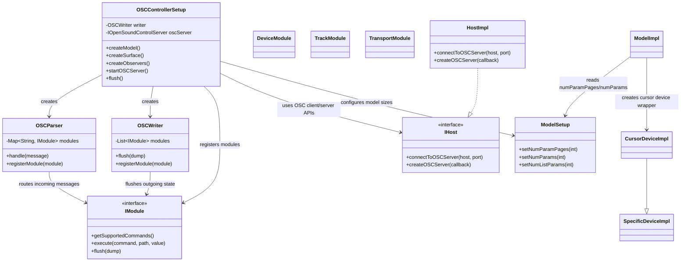

# Task 1 – Repository-/Build-Analyse und OSC-Architektur

## 1) Umgebung und Build-Check

Ausgefuehrte Kommandos:

```bash
java -version
mvn -version
mvn clean install -DskipTests
```

### Ergebnis

- **Java:** OpenJDK 21.0.2 erkannt.
- **Maven:** 3.9.10 erkannt.
- **Build-Status:** **fehlgeschlagen**, aber nicht wegen Quellcode/Kompilation.

Fehlerursache beim Build:

- Maven konnte `maven-enforcer-plugin:3.6.2` nicht von Maven Central laden.
- HTTP-Fehler: `403 Forbidden` beim Zugriff auf `https://repo.maven.apache.org/maven2`.
- Damit ist der initiale Build aktuell durch eine externe Repository-/Netzwerk- bzw. Zugriffsbeschraenkung blockiert.

---

## 2) Relevante Verzeichnisstruktur (fokussiert)

### `src/main/java/de/mossgrabers/controller/osc/`

- `OSCControllerSetup.java`
  - Setup-Einstieg fuer OSC-Controller.
  - Erstellt Model (`ModelSetup`), Surface, Parser/Writer, registriert Module.
  - Startet den OSC-UDP-Server (empfangender Kanal).
- `OSCConfiguration.java`
  - OSC-relevante Konfiguration (Host/Ports/Resolution etc.).
- `OSCControlSurface.java`
  - Control-Surface-Integration auf Controller-Seite.
- `module/*`
  - Fachliche OSC-Kommandogruppen (`DeviceModule`, `TrackModule`, `TransportModule`, ...).
- `protocol/OSCParser.java`
  - Verarbeitung eingehender OSC-Nachrichten, Routing auf Module.
- `protocol/OSCWriter.java`
  - Versand ausgehender OSC-Nachrichten inkl. Flush/Heartbeat.

### `src/main/java/de/mossgrabers/framework/`

- `framework/osc/*`
  - Abstraktionen fuer OSC (`AbstractOpenSoundControlParser`, `...Writer`, `IOpenSoundControlServer`, `...Client`, `...Message`).
- `framework/daw/ModelSetup.java`
  - zentrale Modellparameter (u. a. `numParamPages`, `numParams`, `numListParams`).
- `framework/daw/IHost.java`
  - Host-Interface mit OSC-Factory-Methoden (`createOSCServer`, `connectToOSCServer`).

### `src/main/java/de/mossgrabers/framework/daw/`

- DAW-Abstraktionsschicht (Model-/Device-/Parameter-Interfaces), die von der Bitwig-Implementierung umgesetzt wird.

### `src/main/java/de/mossgrabers/bitwig/`

- `bitwig/framework/daw/ModelImpl.java`
  - uebernimmt Werte aus `ModelSetup` und reicht sie an Track-/Device-Implementierungen weiter.
- `bitwig/framework/daw/data/CursorDeviceImpl.java`
  - Cursor-Device-Wrapper, basiert auf `SpecificDeviceImpl`.
- `bitwig/framework/daw/data/SpecificDeviceImpl.java`
  - erzeugt u. a. `ParameterBankImpl` (Remote Controls) und `ParameterListImpl` (listenbasierte Parameterbeobachtung).
- `bitwig/framework/daw/HostImpl.java`
  - konkrete Bitwig-OSC-Anbindung (UDP Client/Server via Bitwig `OscModule`).

---

## 3) OSC-Einstiegspunkte (Input/Output/Server)

## 3.1 Eingehende OSC-Nachrichten (Parser/Handler)

**Klasse:** `de.mossgrabers.controller.osc.protocol.OSCParser`

- `handle(IOpenSoundControlMessage message)`:
  - loggt Nachricht,
  - zerlegt OSC-Adresse in Pfadteile,
  - Sonderfall `refresh` → kompletter Flush,
  - ansonsten Routing auf registriertes `IModule` nach erstem Adresssegment.
- Module werden ueber `registerModule(IModule)` angebunden.

## 3.2 Ausgehende OSC-Nachrichten (Writer)

**Klasse:** `de.mossgrabers.controller.osc.protocol.OSCWriter`

- erbt von `AbstractOpenSoundControlWriter`.
- verwaltet Modul-Liste und triggert `module.flush(dump)` fuer alle Module.
- sendet Heartbeat/Update (`/update`) nach Flush.
- Module werden ueber `registerModule(IModule)` registriert.

## 3.3 OSC-Server-Konfiguration und Start

**Klasse:** `de.mossgrabers.controller.osc.OSCControllerSetup`

- In `createSurface()`:
  - erzeugt OSC-Client (`host.connectToOSCServer(sendHost, sendPort)`) fuer ausgehende Nachrichten,
  - erstellt Parser/Writer,
  - registriert alle OSC-Module,
  - erzeugt OSC-Serverobjekt (`host.createOSCServer(parser)`).
- In `createObservers()`:
  - registriert Setting-Observer auf Receive-Port, der `startOSCServer()` ausloest.
- In `startOSCServer()`:
  - validiert `sendPort != receivePort`,
  - startet UDP-Server auf konfiguriertem Receive-Port,
  - Fehlerbehandlung via `IOException`.

**Bitwig-spezifische Umsetzung:** `de.mossgrabers.bitwig.framework.daw.HostImpl`

- `connectToOSCServer(...)` → UDP-Client ueber Bitwig `OscModule`.
- `createOSCServer(callback)` → UDP-Server mit Default-Method, die an OSC-Callback weiterreicht.

---

## 4) Klassendiagramm (OSC-relevante Komponenten)



---

## 5) Kurzfazit fuer Folge-Tasks

- Die OSC-Infrastruktur ist klar modular aufgebaut: **Parser (Input) → Module → Writer (Output)**.
- Rueckwaertskompatible Erweiterungen fuer `/device/allparams/...` lassen sich am saubersten im `DeviceModule` plus darunterliegender Device-/Parameter-Abstraktion ergaenzen.
- Die Groessensteuerung der beobachteten Parameter liegt nicht nur im OSC-Code, sondern ueber `ModelSetup` → `ModelImpl` → `SpecificDeviceImpl`/`ParameterListImpl`.
- Der aktuelle Build-Blocker ist extern (Maven-Download 403), nicht durch Java-/Compilerfehler im Repository bedingt.
